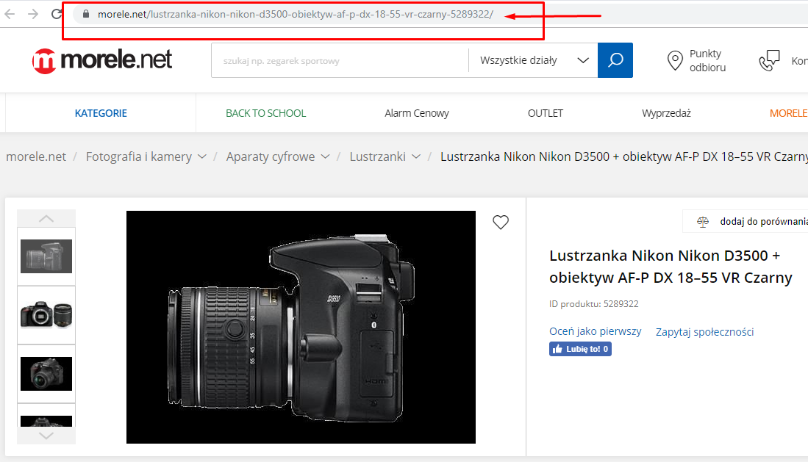
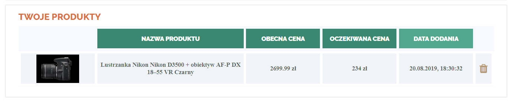

## Alert cenowy

#### Alert cenowy is an application to observe products prices.
#### Main usage
   1. Register (this is my first app with login, because of security vulnerabilities I recommend to use fake user data, for example using http://niepodam.pl/)
   2. Sign in
   3. Find product you would like to buy (currently server supports only morele.net)
   4. Copy products URL
      ####
      
   5. Paste URL into input box
      ####
      
   6. Set price you would like to pay for the product
      ####
      
   6. Added product should appear on your products list
      ####
      
   7. Server will send you an e-mail message when the product will cost less than or equal to expected price.

#### Other fetaures
   1. If you forgot password, you can reset it
   2. Setting page with possibility to change password
   3. Sorting products by name, prices or date of adding
   4. Editing products 
   5. Removing products 
##
#### Click [here](http://alertcenowy.azurewebsites.net/) to see how it works.
##
#### Click [here](https://github.com/lukaszgaj/price-observer-backend/tree/monitorProducts) to see repository with server side of application
##
### Technologies used in the project:
   1. TypeScript
   2. ReactJS
   3. Styled components
   4. Redux-saga
##